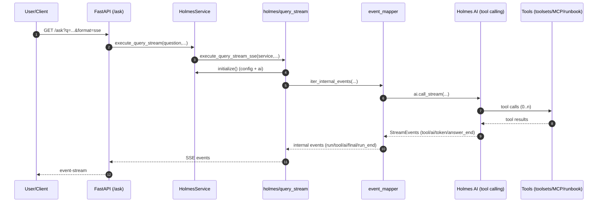
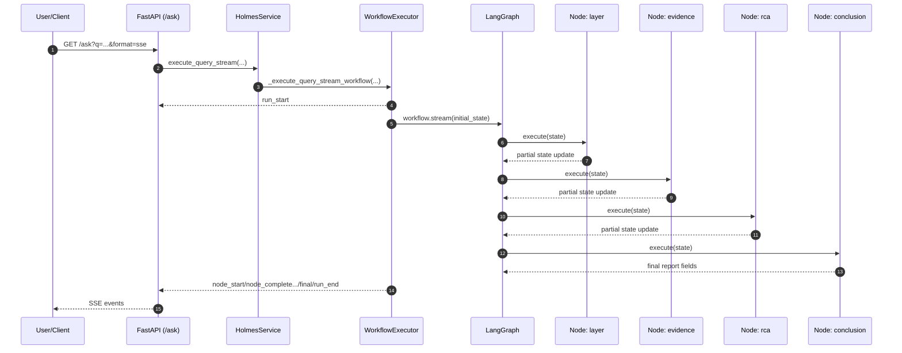
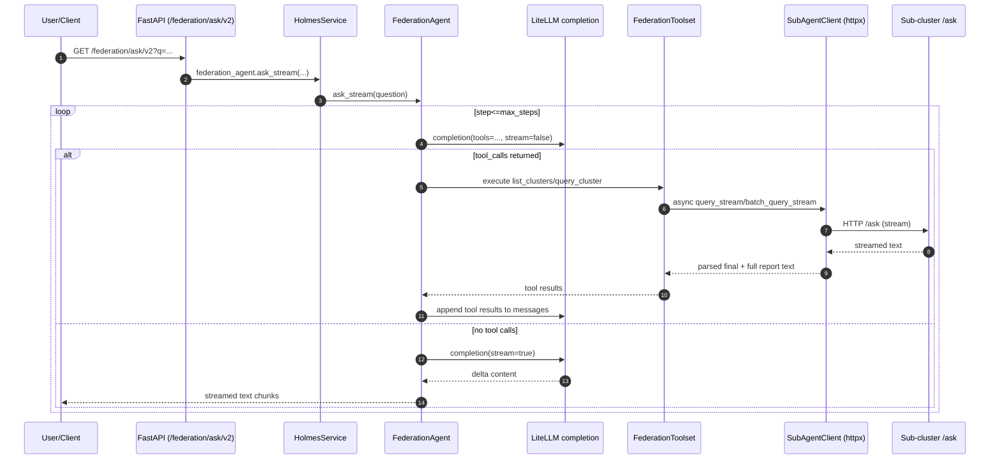

## 整体架构设计与实现（技术实现版）

本文从**代码结构、执行链路、核心数据结构与协议**三个层面，描述 `robusta/` 子项目（HolmesGPT API Server / AIOps Copilot）在单集群诊断、多集群联邦、MCP 工具集成、Runbook 知识库、以及可选 LangGraph 工作流模式下的实现与运行机制。

> 适用读者：需要二次开发、排障、扩展工具/知识库/联邦能力的开发者与运维平台工程师。

---

## 1. 项目分层与模块边界

### 1.1 “Web Server / Service / Runtime” 三层划分

- **Web Server 层（FastAPI）**
  - 只负责生命周期、路由注册、HTTP 输入输出（文本流与 SSE）。
  - 入口：`app/main.py`
  - 路由：`app/api/routes.py`

- **Service 层（HolmesService 编排器）**
  - 负责初始化、配置加载、AI 实例创建、Runbook 合并、联邦组件初始化、以及对外提供查询执行 API。
  - 核心：`app/core/service.py`（单例模式）

- **Runtime 层（Holmes 封装 / 事件协议 / 工具 / 工作流 / 联邦）**
  - 将“模型工具调用循环”与“输出协议/事件映射”解耦，保证对外输出稳定一致。
  - Holmes 封装：`app/core/holmes/*`
  - MCP 管理：`app/core/mcp/*`
  - Runbook：`app/core/runbook.py` + `knowledge_base/runbooks/*`
  - LangGraph 工作流：`app/core/workflow/*`
  - 联邦多集群：`app/core/federation/*`

---

## 2. 启动与生命周期（FastAPI lifespan）

### 2.1 启动流程总览

入口 `app/main.py` 使用 `lifespan` 做两件事：

1. **可选：本地 MCP 子进程 auto-start**
   - 默认关闭（生产推荐连接远程 MCP Server）。
   - 通过 `MCP_AUTO_START_LOCAL=true` 开启。
2. **初始化 HolmesService**
   - 支持可选超时：`HOLMES_INIT_TIMEOUT_SECONDS`。
   - 无超时则同步阻塞直到初始化完成。

关键代码位置：
- `app/main.py`：lifespan 中调用 `auto_start_mcp_servers()`，然后 `get_service().initialize()`

### 2.2 “本地 auto-start MCP” 的设计定位

`app/core/mcp/manager.py` 明确将职责限制为：
- **仅管理本地脚本进程（auto-start）**
- **不负责远程 MCP 的连接**（远程连接属于 Holmes/Toolset 的范畴，通常通过 `config.yaml mcp_servers.url`）

核心数据结构：
- `MCPServerInfo`（dataclass）：保存 `name/url/port/enabled/script_path/process/status/error` 等运行态信息，用于启动、健康检查、停止与状态查询。

---

## 3. HTTP API 设计与执行入口

### 3.1 单集群查询入口 `/ask`

`app/api/routes.py` 提供：
- `GET /ask?q=...&stream=true&format=text|sse&max_steps=...`
- `POST /ask`（Form）
- 兼容旧接口：`/api/v1/query` 与 `/api/v1/query/stream`

路由层本质上只是将 `question/max_steps/format` 传给 `HolmesService.execute_query()` 或 `HolmesService.execute_query_stream()`。

### 3.2 联邦多集群入口 `/federation/*`

同一文件中提供两条链路：

- **v1 聚合式联邦**：`/federation/ask`
  - 由 `service.federation_coordinator.ask_stream(...)` 负责（具体实现位于 `app/core/federation/*` 的 coordinator/aggregator）。

- **v2 Agent-to-Agent**：`/federation/ask/v2`
  - 由 `service.federation_agent.ask_stream(...)` 负责（`app/core/federation/agent.py`）。
  - 这是“主 Agent 通过 Tool Calling 选择子集群并并发 query_cluster”的模式。

---

## 4. HolmesService：配置加载、AI 初始化与查询执行

### 4.1 HolmesService 的职责与状态

`app/core/service.py` 的 `HolmesService` 是全局单例（`get_service()`），核心字段：

- `config: Optional[holmes.config.Config]`：Holmes 原生配置对象
- `ai: Any`：由 `config.create_console_toolcalling_llm()` 创建的“可 Tool Calling 的 LLM runtime”
- `runbook_manager: RunbookManager`：管理 `knowledge_base/runbooks` 与额外目录
- `merged_catalog: Optional[RunbookCatalog]`：内置 runbook catalog + 自定义 catalog 合并结果
- `stream_output: bool`：决定同步 `ai.call()` 还是流式 `ai.call_stream()`（由 YAML 配置读取）
- `federation_coordinator / federation_agent`：联邦能力（可选启用）

并发安全：
- 初始化使用 `_init_lock` + `_init_in_progress/_init_error` 防止并发重复初始化与状态竞争。

### 4.2 配置优先级与解析策略

`initialize()` 在加载 Holmes Config 之前，会先读取原始 YAML，用于：
- 替换环境变量（支持 `${VAR:-default}` 形式）
- 提取 `llm` 配置块
- 决定 `stream_output`（避免被 Holmes Config 的字段校验拦住）
- 初始化 federation（需要先读取原始 `federation` 块）

LLM 配置的关键优先级：

1. `initialize(api_key/model)` 参数
2. 环境变量：`LLM_API_KEY` / `LLM_MODEL` / `LLM_API_BASE`
3. YAML：`llm.api_key` / `llm.model` / `llm.api_base`
4. 默认模型：`deepseek/deepseek-chat`

### 4.3 Runbook 加载与合并（RunbookManager）

`app/core/runbook.py` 的 `RunbookManager` 做两类工作：

- **catalog 加载与过滤**
  - 读取 `knowledge_base/runbooks/catalog.json`
  - 校验每个 entry 的 `link` 指向的 `.md` 是否存在（支持相对路径，且会在 `runbook_dir + additional_dirs` 中查找）
  - 过滤无效条目后构造 `RunbookCatalog`

- **运行时搜索路径注入**
  - 在 `ai.tool_executor.toolsets` 中定位 `toolset.name == "runbook"`
  - 更新 `toolset.config["additional_search_paths"]`
  - 同步更新每个 runbook tool 的 `additional_search_paths` 与 `available_runbooks`（扫描 `*.md`）

> 设计动机：catalog 解决“有哪些 runbook”，搜索路径注入解决“运行时工具去哪读 md”。

---

## 5. 输出协议：统一内部事件（Internal Event Schema）

项目的一个关键设计是：**把 Holmes 的 stream events 映射为“统一内部事件协议”**，再渲染成 text 或 SSE。

### 5.1 为什么要做内部事件协议

Holmes 原始流式事件（`holmes.utils.stream.StreamEvents`）可能：
- 表达粒度不稳定（不同版本差异）
- 可能出现 DSML/草稿片段被当成最终答案
- tool result 过长时难以处理（截断/保存）

因此，本项目在 `app/core/holmes/event_schema.py` + `event_mapper.py` 中定义并实现：
- **统一字段**：`{type, id, run_id, seq, ts_ms, ...payload}`
- **稳定闭环**：任何情况下都产出 `final` 与 `run_end`
- **最终答案选择策略**：在 framework `ANSWER_END` 与 `last_ai_content` 之间选择更可靠的最终输出

### 5.2 核心算法：final 选择（避免 DSML/阻塞）

`event_schema.select_final_answer()` 输入：
- `framework_content`：StreamEvents.ANSWER_END 的 content
- `last_ai_content`：最后一次 `AI_MESSAGE` 内容（过滤 DSML）
- `saw_approval_required`：是否被策略阻塞

选择策略（简述）：
- 若 `approval_required`：交给上层输出“被阻塞说明”，避免输出工具调用草稿
- 若 framework 含 DSML、last_ai 是正常内容：优先 last_ai
- 若 last_ai 是“结构化报告”，framework 不是：优先 last_ai
- 若 framework 太短且 last_ai 有内容：优先 last_ai
- 否则：用 framework

### 5.3 事件映射与 artifact 存储（tool_result 长输出）

`app/core/holmes/event_mapper.py` 的 `iter_internal_events()`：
- 把 Holmes 的 `START_TOOL/TOOL_RESULT/AI_MESSAGE/TOKEN_COUNT/...` 转成内部事件
- 对 `tool_result` 的 `result_str` 做 `preview + truncated`：
  - 超过阈值时将全文放入 `ArtifactStore`（内存 + TTL）
  - 事件里只返回 `result_preview` 与 `artifact_id`

artifact 存储实现：
- `app/core/holmes/artifacts.py`
  - `ArtifactStore(max_items=200, ttl_seconds=1800)`
  - `put(content) -> artifact_id`
  - `get(artifact_id) -> Artifact`

HTTP 取回全文：
- `GET /artifacts/{artifact_id}`（`app/api/routes.py`）

---

## 6. 两种执行引擎：Agentic Loop vs LangGraph 工作流

系统在流式查询时（`HolmesService.execute_query_stream`）会根据环境变量选择执行引擎：

- `USE_WORKFLOW=false`（默认）：HolmesGPT agentic loop
- `USE_WORKFLOW=true`：LangGraph 工作流模式（POC/可扩展）

### 6.1 默认模式：Holmes agentic loop（以内部事件协议输出）

代码主链路：
- `routes.py` → `service.execute_query_stream(...)`
- 非 workflow：
  - `app/core/holmes/query_stream.py`
    - `execute_query_stream_text(...)` 或 `execute_query_stream_sse(...)`
    - 构建 messages：`holmes.core.prompt.build_initial_ask_messages(...)`
    - 迭代事件：`iter_internal_events(...)`（统一内部事件）
    - SSE 输出：`create_sse_message_cn(event_type, data)`

对外 SSE 事件至少包含：
- `run_start`：初始化信息
- `tool_start/tool_result`：工具调用
- `ai_message/ai_reasoning`：模型输出
- `iteration_end`：token 与耗时
- `final`：最终答案（保证存在）
- `run_end`：结束
- 兼容事件：`stream_end`（旧客户端可能依赖）

### 6.2 工作流模式：LangGraph 四阶段诊断流水线

#### 6.2.1 工作流图（Graph）

`app/core/workflow/graph.py` 构造线性图：

`layer → evidence → rca → conclusion → END`

每个节点都是 `Node.execute(state) -> partial_state_update` 的形式，LangGraph 将增量更新合并到 `WorkflowState`。

#### 6.2.2 核心状态数据结构：WorkflowState

`app/core/workflow/state.py` 定义 `WorkflowState(TypedDict, total=False)`，强调：
- **增量更新**：每个节点只写自己负责的字段
- **结构化字段 + LLM 分析文本并存**：
  - 结构化：`layer/evidence_items/deterministic_decision/root_cause/...`
  - 过程文本：`layer_analysis/evidence_analysis/rca_analysis`（通常是 JSON 字符串，便于追溯）

与 skills 数据结构对齐：
- `Layer`（Enum）
- `EvidenceItem`（dataclass）
- `DeterministicDecision`（dataclass，确定性判定结果）

#### 6.2.3 执行器：WorkflowExecutor（SSE 兼容事件）

`app/core/workflow/executor.py` 的 `execute_stream()` 输出事件，尽量保持与内部事件协议的“形状”一致：
- `run_start`
- `node_start`
- `node_complete`（带 `state_snapshot`）
- `final`（含 `metrics` 摘要）
- `run_end`

其中 `state_snapshot` 会根据节点类型提取摘要字段，便于前端/日志消费。

#### 6.2.4 指标体系：性能 + 质量指标

工作流会记录：
- 性能指标：节点耗时、MTTR（总耗时）等
- 质量指标：证据完整率、根因置信度等

并将统计块附加到最终报告末尾（`metrics.format_stats_block()` / `metrics.format_metrics_block()`）。

---

## 7. skills：核心确定性数据结构（可解释的诊断输出）

`app/core/skills/models.py` 定义了整个系统里最关键的一组“可解释结构化输出”：

- `Layer`：诊断层级（QUERY/L0-L4）
- `EvidenceItem`：证据项（含 `id/description/level/weight/collected/value/source`）
- `DeterministicDecision`：确定性判定结果（核心输出对象）
  - `scenario/category/confidence/confidence_score/issue_summary`
  - `context`：用于模板填充（如 pod/namespace/exit_code）
  - `evidence_details/causal_chain/remediation_steps/verification_steps`

系统如何使用它：
- 默认 agentic loop 模式下，`event_mapper.iter_internal_events()` 会在 final 生成前尝试：
  - `evaluate_deterministic_decision(question, internal_events)`
  - 若产生 decision，则发出 `deterministic_decision` 事件，并把 `format_decision_markdown(decision)` 追加到最终答案（**软拦截，不阻断主输出**）。

> 这个设计让系统在“模型输出不稳定/不够结构化”时，仍能提供一份可追溯、可解释、可度量的诊断补充。

---

## 8. 联邦多集群（Federation）：两套实现路径

### 8.1 子集群注册表：AgentRegistry

`app/core/federation/registry.py`：
- `SubAgentConfig(name, url, description, enabled)`（dataclass）
- `AgentRegistry.load_from_dict(federation_config)` 从 YAML 的 `federation.sub_agents` 生成注册表
- `get_enabled_agents()` 返回启用列表

这套结构在两种联邦模式下复用：
- v1 coordinator/aggregator
- v2 FederationAgent + FederationToolset

### 8.2 v2：FederationAgent（真正的 Agent-to-Agent）

`app/core/federation/agent.py` 的核心实现要点：

- 使用 `litellm.completion` 做 Tool Calling 循环：
  - 中间步骤：`stream=False`（更快拿到工具调用决策）
  - 最终生成：`stream=True`（减少首 token 延迟）

- 工具集 `FederationToolset`（见 `toolset.py`）提供：
  - `list_clusters()`
  - `query_cluster(cluster_name, question, max_steps, conclusion_max_tokens)`

- 并发优化：
  - 当 LLM 一次提出多个 `query_cluster` 调用时，会把这些调用合并到一个批次里，通过 `asyncio.gather` 并发请求子集群（共享连接池）。

子集群调用形态：
- `SubAgentClient.query_stream(...)`（底层为 httpx 异步请求）
- 返回子集群流式文本后：
  - 解析出最终答案片段（`extract_final_answer`）
  - 将完整报告保存到本地 `reports/*.md`

---

## 9. 端到端执行链路（带 Mermaid 图）

### 9.1 单集群 /ask（默认 agentic loop，SSE）

### 9.2 单集群 /ask（USE_WORKFLOW=true，工作流模式）

### 9.3 联邦 /federation/ask/v2（Agent-to-Agent）

---

## 10. 扩展点与工程化建议（面向二次开发）

### 10.1 扩展工具与 MCP

- 生产推荐：直接在 `config.yaml` 配置 `mcp_servers.<name>.config.url` 指向独立部署的 MCP Server SSE 端点
- 本地/桥接开发：可通过 `MCP_AUTO_START_LOCAL=true` 启动本地脚本（当前仓库默认 `SERVER_SCRIPTS` 为空，更多用于预留能力）

### 10.2 扩展 Runbooks（知识库）

- 新增/编辑：`knowledge_base/runbooks/*.md`
- 更新索引：`knowledge_base/runbooks/catalog.json`
- 若需要多目录（PVC/外部挂载）：在运行时将目录加入 `RunbookManager.additional_dirs`，并调用 `configure_search_path(ai)`

### 10.3 扩展工作流（LangGraph）

当前工作流是线性 4 节点，扩展方向：
- 条件分支（例如 evidence 不足时走“补采证据”分支）
- 并行节点（并发采证）
- 将 `WorkflowState` 中的分析 JSON 结构化（避免字符串 JSON），便于下游程序直接消费

---

## 11. 快速定位：从“你要改什么”到“该看哪里”

- **改 API/输出格式**：`app/api/routes.py`、`app/core/holmes/query_stream.py`、`app/core/holmes/streaming.py`
- **改最终答案选择/防 DSML**：`app/core/holmes/event_schema.py`
- **改事件映射/工具结果截断**：`app/core/holmes/event_mapper.py`、`app/core/holmes/artifacts.py`
- **改初始化/配置优先级/联邦注入**：`app/core/service.py`、`app/core/holmes/config_loader.py`
- **改 Runbook 加载与搜索路径**：`app/core/runbook.py`
- **改联邦 A2A 行为/并发**：`app/core/federation/agent.py`、`app/core/federation/toolset.py`、`app/core/federation/client.py`
- **改工作流状态/节点/指标**：`app/core/workflow/state.py`、`app/core/workflow/nodes/*`、`app/core/workflow/metrics.py`、`app/core/workflow/executor.py`

